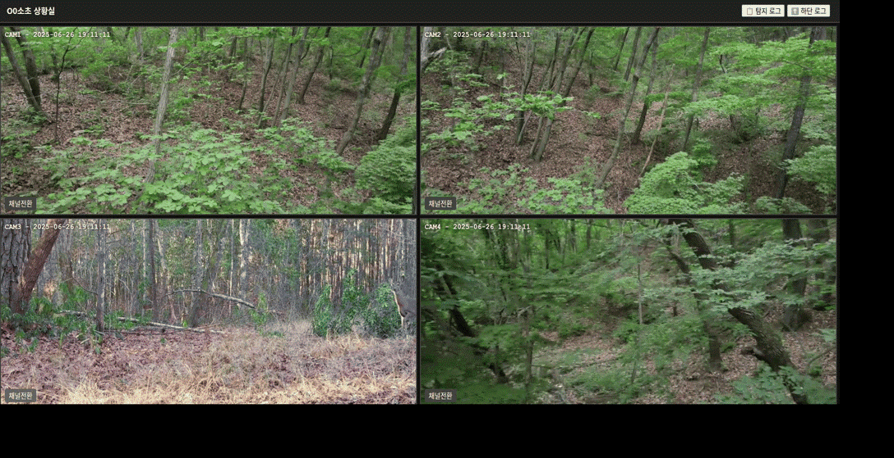
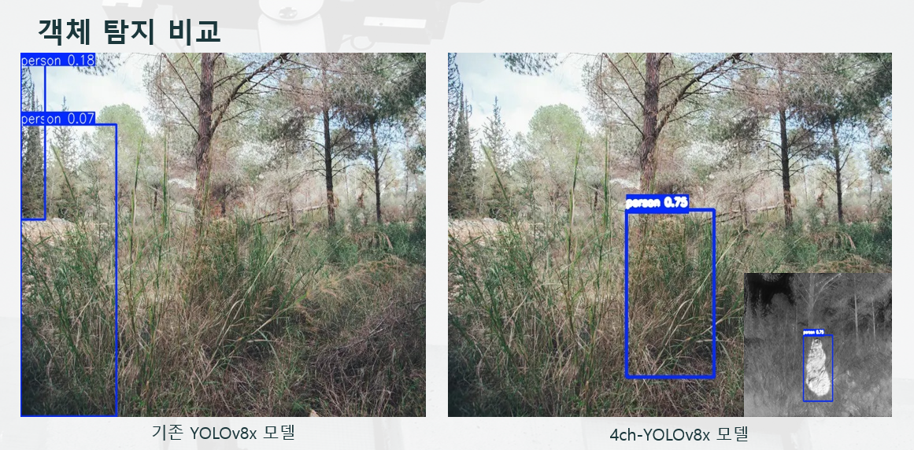
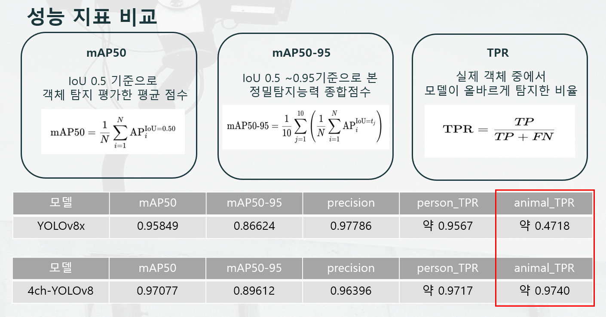

> **본 프로젝트는 한화에어로스페이스 스마트 국방 데이터 분석과정 3기의 ```4채널을 활용한 위장 객체 탐지 고도화``` 프로젝트의 서브프로젝트로 수행되었습니다.**

# 4ch-YOLOv8
이 프로젝트에서 개발한 모델 **4ch-YOLOv8**은 GOP과학화 경계시스템에 활용 될 수 있도록 군인 및 민간인을 포함하는 클래스와 감시 환경에 자주 노출 되는 동물 6종으로 이루어진 클래스로 구성한 RGB + IR(열화상) 이미지로부터 4채널 데이터를 입력으로 사용하는 YOLOv8모델 기반의 객체 탐지 모델입니다.

기존 RGB 기반 모델은 육안으로 구분되지 않는 위장된 객체나 야간 상황등의 객체를 탐지하는 데 한계가 존재하며 이를 해결하기 위해 **IR(열화상) 정보를 추가한 4채널 모델**을 통해 위장 객체 탐지 성능을 개선했습니다.
<p align="center">
  
  
</p>

## Key Modification
### YOLOv8 구조 기반 확장
 - 기존의 YOLOv8 첫 번째 Conv layer(conv1)를 3→4채널로 수정
 - 학습 파라미터 초기값으로 conv1은 랜덤 초기화, 나머지 레이어는 pretrained weights 사용

<p align="center">
  
  
</p>

## Project Environment
- OS: Ubuntu 25.04
- Python: 3.10
- Pytorch:2.2.0
- CUDA:12.1
- GPU: NVIDIA TITAN Xp / A100 (Colab)

## Colab Notebook
Thermal-CycleGAN Tutorial: [](https://colab.research.google.com/github/scksh/4ch-YOLOv8/blob/main/4ch-YOLOv8.ipynb) | [](https://github.com/scksh/4ch-YOLOv8/blob/main/4ch-YOLOv8.ipynb)

## Getting Started
### Installation

- Clone this repo:
```bash
git clone https://github.com/scksh/4ch-YOLOv8
cd 4ch-YOLOv8
```
- install libraries:
```bash
pip install -r requirements.txt
pip install torch==2.7.0 torchvision==0.22.0 torchaudio==2.7.0 --index-url https://download.pytorch.org/whl/cu126
pip install -e ../4ch-YOLOv8
```

### Download Dataset (HuggingFace)
- You can download the `RGBIR` dataset directly from Hugging Face Hub using the following Python code:
```python
from huggingface_hub import hf_hub_download
import zipfile

# Download dataset
zip_path = hf_hub_download(
    repo_id="SUMMERZETT/RGBIR",
    filename="RpGBIR.zip",
    repo_type="dataset"
)

with zipfile.ZipFile(zip_path, 'r') as zip_ref:
    zip_ref.extractall("./datasets")
```

### Download Initial weight
- To download the Initial weight for 4ch-YOLOv8 model from Hugging Face, use the following code:
```python
from huggingface_hub import hf_hub_download

# Download pretrained model
model_path = hf_hub_download(
    repo_id="SUMMERZETT/YOLOv8_pretrained",
    filename="yolov8x_4ch_pretrained.pt",
    repo_type="model",
    local_dir="./model",
    local_dir_use_symlinks=False
)
```
### Download Pre-trained model
- To download the pretrained 4ch-YOLOv8 model from Hugging Face, use the following code:
```python
from huggingface_hub import hf_hub_download

# Download pretrained model
model_path = hf_hub_download(
    repo_id="SUMMERZETT/4ch-YOLOv8",
    filename="4ch-YOLOv8.pt",
    repo_type="model",
    local_dir="./pretrained",
    local_dir_use_symlinks=False
)
```
### Train
- Train a model:
```bash
export KMP_DUPLICATE_LIB_OK=TRUE
yolo task=detect train model=model/yolov8x_4ch_pretrained.pt data=ultralytics/cfg/datasets/RGBIR.yaml workers=2 epochs=1 batch=8 cos_lr=True
```

### Prediction
- Predict the results:
```bash
python predict.py --weights pretrained/4ch-YOLOv8.pt --source_rgb datasets/RGBIR/images/rgb_val --source_ir datasets/RGBIR/images/thermal --project runs/predict --name 4ch-YOLOv8_pred --imgsz 640 --conf 0.4 --iou 0.5 --device cuda
```

## Citation
If you use this code for your research, please cite our papers.
```
@misc{thermalcyclegan2025,
  title={4ch-YOLOv8: Object detection using 4channel images contain RGB+IR},
  author={Cha, Hyunwoo and Do, Jihoon and Gang, Nayoon and Kim, Seunghwan and Lee, Haerin and Yoon, Youngbin},
  year={2025},
  howpublished={\url{https://github.com/scksh/4ch-YOLOv8}},
  note={GitHub repository}
}
```

## Acknowledgments
Our code is inspired by 
- [ultralytics](https://github.com/ultralytics/ultralytics)

